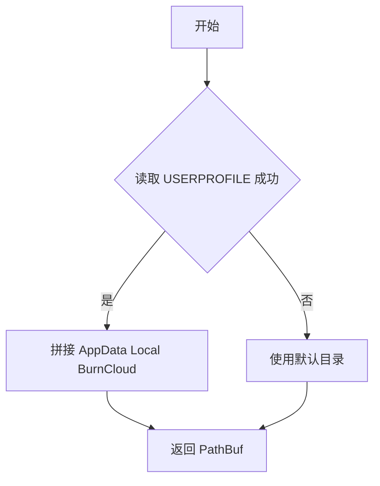

# constants.rs

## 公有函数

### get_burncloud_dir
- 函数定义：`pub(crate) fn get_burncloud_dir() -> PathBuf`
- 入参：无。
- 返回值：`PathBuf`；BurnCloud 本地数据目录。
- 错误信息：不返回错误；读取 `USERPROFILE` 失败时使用默认目录。
- 设计流程图：

```mermaid
flowchart TD
  A[开始] --> B{读取 USERPROFILE 成功}
  B -->|是| C[拼接 AppData Local BurnCloud]
  B -->|否| D[使用默认目录]
  C --> E[返回 PathBuf]
  D --> E
```
