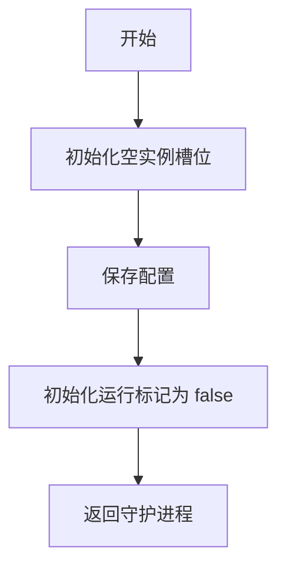
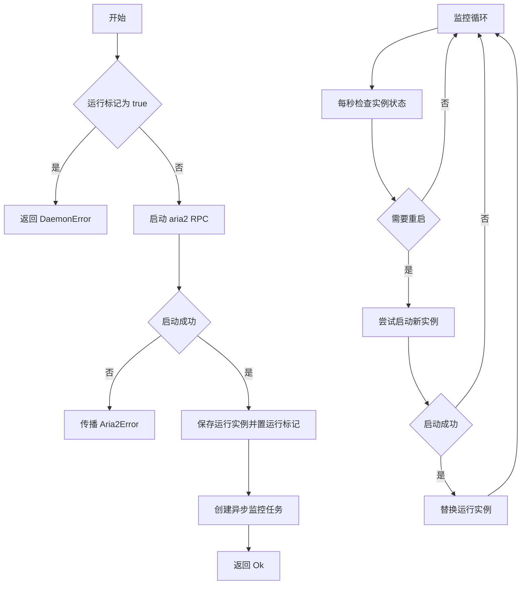
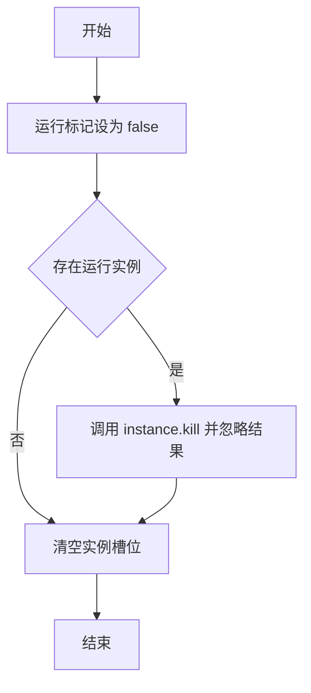
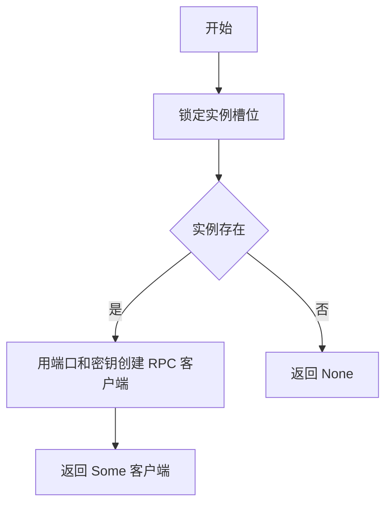
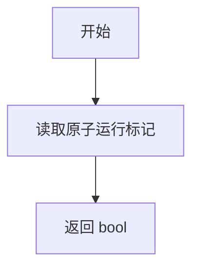

# daemon.rs

## 公有函数

### new
- 函数定义：`pub fn new(config: Aria2Config) -> Self`
- 入参：`config: Aria2Config`；aria2 运行配置。
- 返回值：`Self`；未启动的 `Aria2Daemon`。
- 错误信息：无。
- 设计流程图：

### start
- 函数定义：`pub async fn start(&mut self) -> Aria2Result<()>`
- 入参：`&mut self`；待启动的守护进程。
- 返回值：`Aria2Result<()>`；成功时服务启动并创建监控任务。
- 错误信息：重复启动时返回 `DaemonError`；首次启动失败时传播端口、进程或 RPC 错误；监控中的重启失败被忽略。
- 设计流程图：

### stop
- 函数定义：`pub async fn stop(&mut self)`
- 入参：`&mut self`；待停止的守护进程。
- 返回值：无（`()`）；运行标记被清除，保存的实例被移除。
- 错误信息：不返回错误；终止子进程失败被忽略。
- 设计流程图：

### get_rpc_client
- 函数定义：`pub fn get_rpc_client(&self) -> Option<Aria2RpcClient>`
- 入参：`&self`；守护进程对象。
- 返回值：`Option<Aria2RpcClient>`；实例存在时返回新客户端，否则为 `None`。
- 错误信息：不返回错误；互斥锁中毒时恢复其值。
- 设计流程图：

### is_running
- 函数定义：`pub fn is_running(&self) -> bool`
- 入参：`&self`；守护进程对象。
- 返回值：`bool`；原子运行标记的当前值。
- 错误信息：无。
- 设计流程图：

