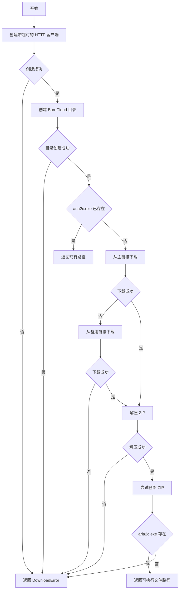
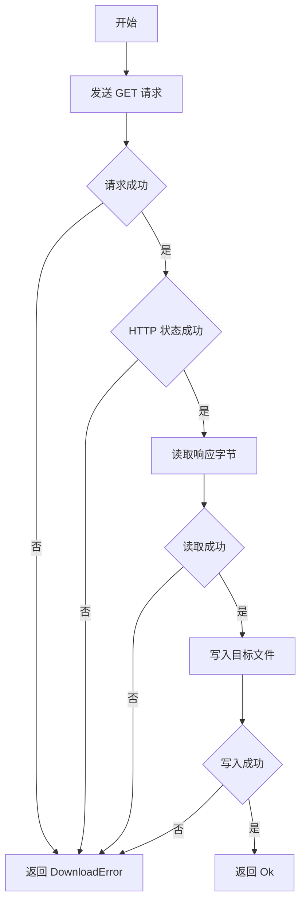
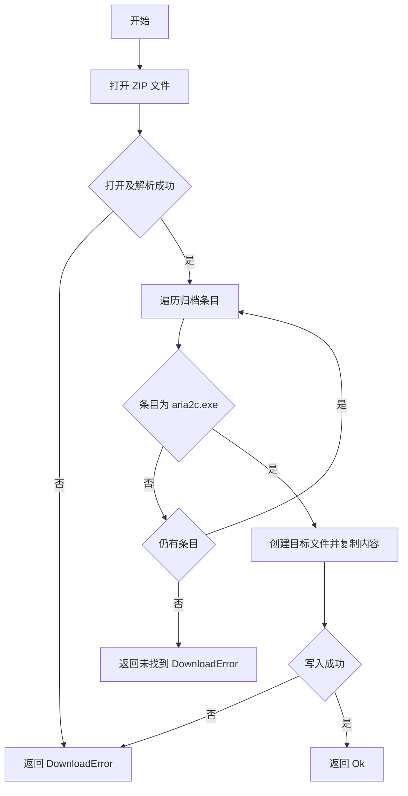

# downloader.rs

## 公有函数

### download_aria2
- 函数定义：`pub async fn download_aria2() -> Aria2Result<PathBuf>`
- 入参：无。
- 返回值：`Aria2Result<PathBuf>`；成功时返回本地 `aria2c.exe` 路径。
- 错误信息：客户端创建、目录创建、两条下载链接均失败、解压失败或未找到可执行文件时返回 `DownloadError`；删除 ZIP 失败被忽略。
- 设计流程图：

## 私有函数

### download_file
- 函数定义：`async fn download_file(client: &Client, url: &str, path: &Path) -> Aria2Result<()>`
- 入参：`client` 为 HTTP 客户端；`url` 为资源地址；`path` 为输出文件路径。
- 返回值：`Aria2Result<()>`；成功时将响应内容写入目标文件。
- 错误信息：请求、HTTP 状态、读取正文或写文件失败时返回 `DownloadError`。
- 设计流程图：

### extract_aria2
- 函数定义：`fn extract_aria2(zip_path: &Path, target_dir: &Path) -> Aria2Result<()>`
- 入参：`zip_path` 为 ZIP 文件路径；`target_dir` 为解压目标目录。
- 返回值：`Aria2Result<()>`；成功时写入 `aria2c.exe`。
- 错误信息：打开或解析 ZIP、读取条目、创建文件、复制内容失败，或未找到 `aria2c.exe` 时返回 `DownloadError`。
- 设计流程图：

