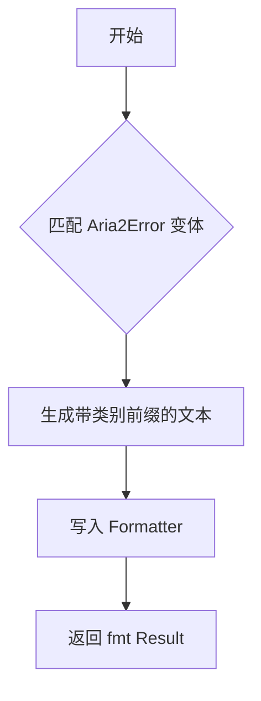

# error.rs

## 公有函数
本文件未直接定义 `pub` 函数或方法。

## 私有函数

### fmt
- 函数定义：`fn fmt(&self, f: &mut std::fmt::Formatter<'_>) -> std::fmt::Result`
- 入参：`&self` 为 `Aria2Error`；`f` 为格式化输出器。
- 返回值：`std::fmt::Result`；写入对应的中文错误文本。
- 错误信息：格式化写入失败时返回 `std::fmt::Error`。
- 设计流程图：

