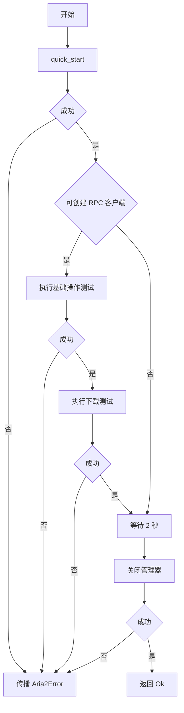
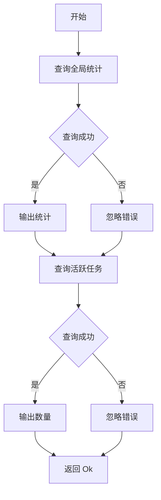
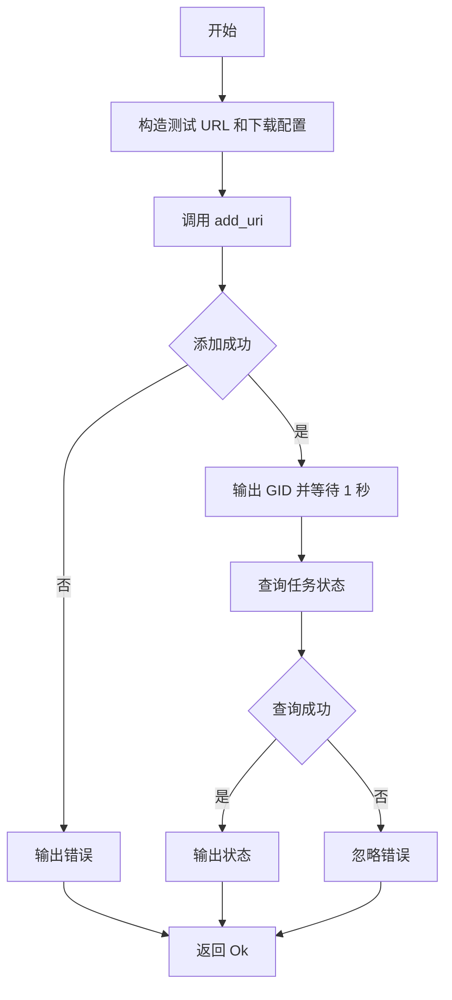

# main.rs

## 公有函数
本文件未定义 `pub` 函数或方法。

## 私有函数

### main
- 函数定义：`async fn main() -> Aria2Result<()>`
- 入参：无。
- 返回值：`Aria2Result<()>`；成功时完成启动、测试、等待和关闭。
- 错误信息：传播 `quick_start`、`test_basic_operations`、`test_download` 或 `shutdown` 的错误。
- 设计流程图：

### test_basic_operations
- 函数定义：`async fn test_basic_operations(client: &Aria2RpcClient) -> Aria2Result<()>`
- 入参：`client: &Aria2RpcClient`；已连接的 RPC 客户端。
- 返回值：`Aria2Result<()>`；当前实现始终返回 `Ok(())`。
- 错误信息：`get_global_stat` 和 `tell_active` 失败被忽略。
- 设计流程图：

### test_download
- 函数定义：`async fn test_download(client: &Aria2RpcClient) -> Aria2Result<()>`
- 入参：`client: &Aria2RpcClient`；已连接的 RPC 客户端。
- 返回值：`Aria2Result<()>`；当前实现始终返回 `Ok(())`。
- 错误信息：添加任务或状态查询失败不会返回，仅输出或忽略。
- 设计流程图：

