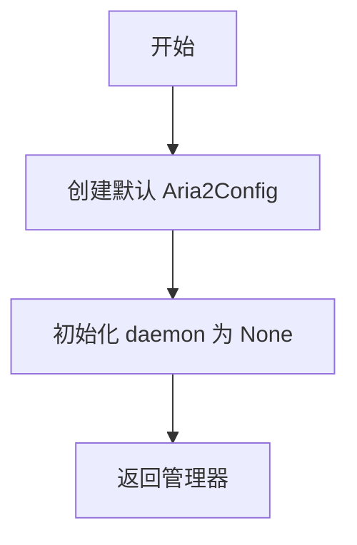
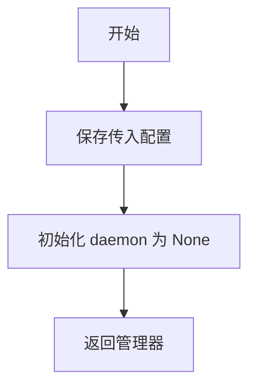
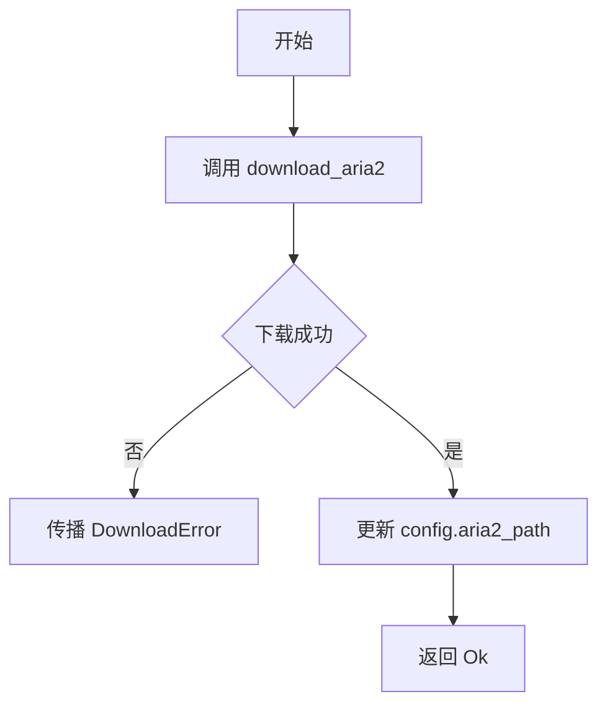
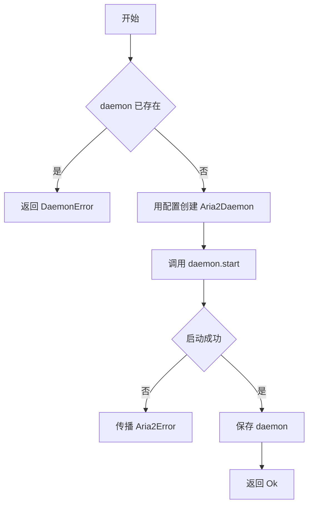
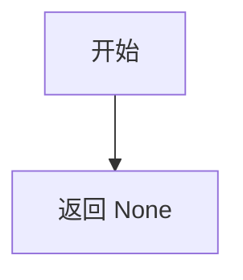
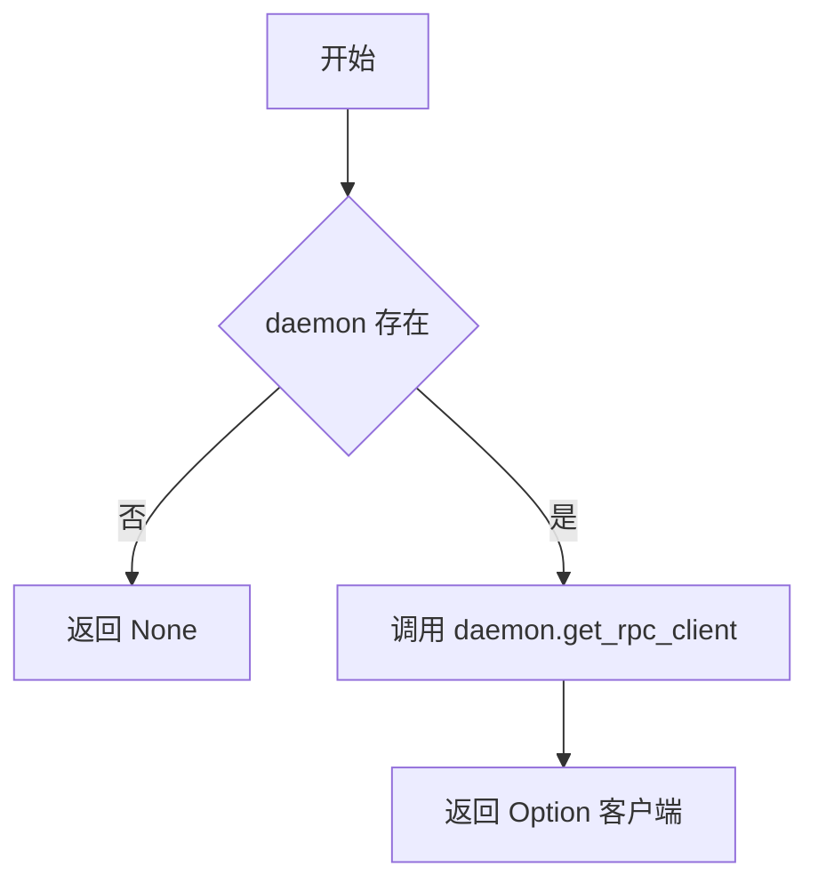
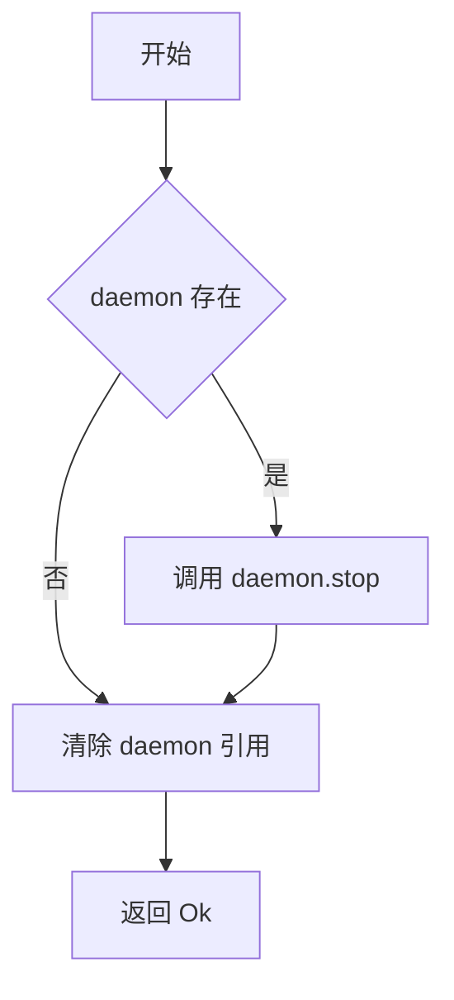
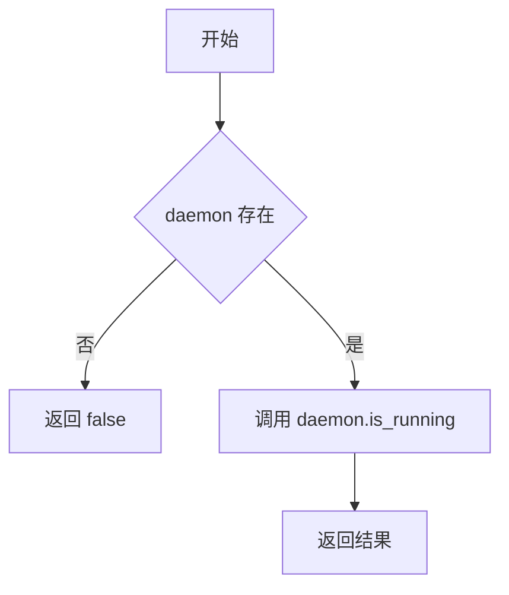
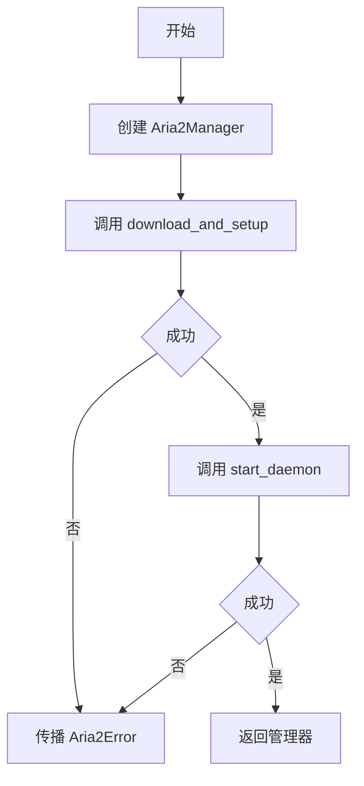
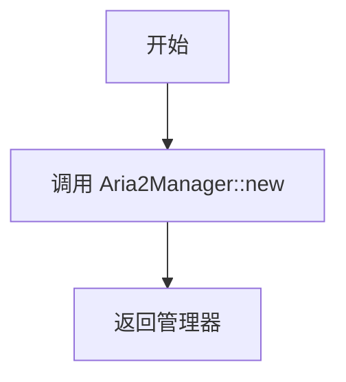

# manager.rs

## 公有函数

### new
- 函数定义：`pub fn new() -> Self`
- 入参：无。
- 返回值：`Self`；使用默认配置且未持有守护进程的管理器。
- 错误信息：无。
- 设计流程图：

### with_config
- 函数定义：`pub fn with_config(config: Aria2Config) -> Self`
- 入参：`config: Aria2Config`；调用方提供的配置。
- 返回值：`Self`；使用指定配置且未持有守护进程的管理器。
- 错误信息：无。
- 设计流程图：

### download_and_setup
- 函数定义：`pub async fn download_and_setup(&mut self) -> Aria2Result<()>`
- 入参：`&mut self`；要更新配置的管理器。
- 返回值：`Aria2Result<()>`；成功时配置中的 `aria2_path` 已更新。
- 错误信息：下载失败时传播 `DownloadError`。
- 设计流程图：

### start_daemon
- 函数定义：`pub async fn start_daemon(&mut self) -> Aria2Result<()>`
- 入参：`&mut self`；要启动服务的管理器。
- 返回值：`Aria2Result<()>`；成功时保存已启动的守护进程。
- 错误信息：已有守护进程时返回 `DaemonError`；启动失败时传播底层 `Aria2Error`。
- 设计流程图：

### get_rpc_client
- 函数定义：`pub fn get_rpc_client(&self) -> Option<&Aria2RpcClient>`
- 入参：`&self`；管理器对象。
- 返回值：`Option<&Aria2RpcClient>`；当前实现始终为 `None`。
- 错误信息：无。
- 设计流程图：

### create_rpc_client
- 函数定义：`pub fn create_rpc_client(&self) -> Option<Aria2RpcClient>`
- 入参：`&self`；管理器对象。
- 返回值：`Option<Aria2RpcClient>`；守护进程和运行实例存在时返回客户端，否则为 `None`。
- 错误信息：不返回错误；底层锁中毒会被恢复处理。
- 设计流程图：

### shutdown
- 函数定义：`pub async fn shutdown(&mut self) -> Aria2Result<()>`
- 入参：`&mut self`；要关闭的管理器。
- 返回值：`Aria2Result<()>`；成功时守护进程已停止且引用已清除。
- 错误信息：不主动返回错误；停止中发生的进程终止错误被忽略，当前实现始终返回 `Ok(())`。
- 设计流程图：

### is_running
- 函数定义：`pub fn is_running(&self) -> bool`
- 入参：`&self`；管理器对象。
- 返回值：`bool`；守护进程存在且运行标记为真时为 `true`。
- 错误信息：无。
- 设计流程图：

### quick_start
- 函数定义：`pub async fn quick_start() -> Aria2Result<Aria2Manager>`
- 入参：无。
- 返回值：`Aria2Result<Aria2Manager>`；返回下载并启动完成的管理器。
- 错误信息：传播下载配置或启动守护进程返回的 `Aria2Error`。
- 设计流程图：

## 私有函数

### default
- 函数定义：`fn default() -> Self`
- 入参：无。
- 返回值：`Self`；默认 `Aria2Manager`。
- 错误信息：无。
- 设计流程图：

