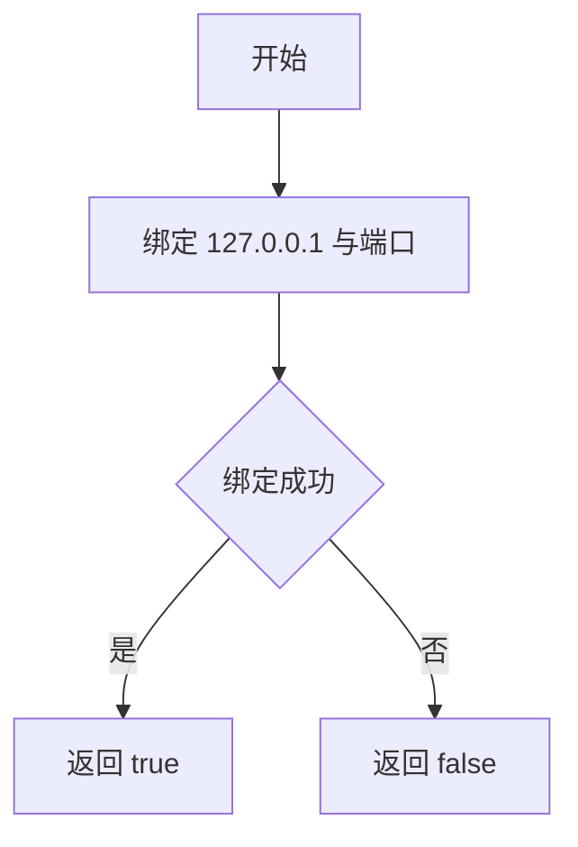
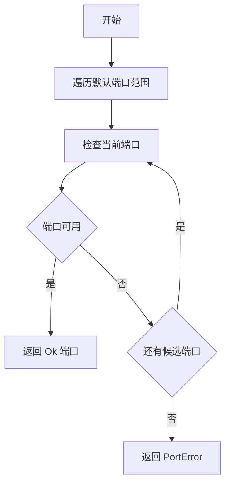
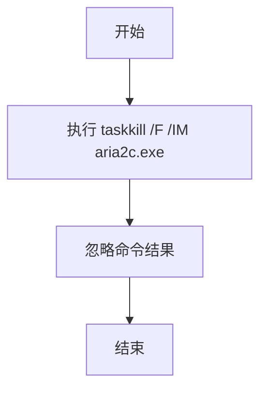
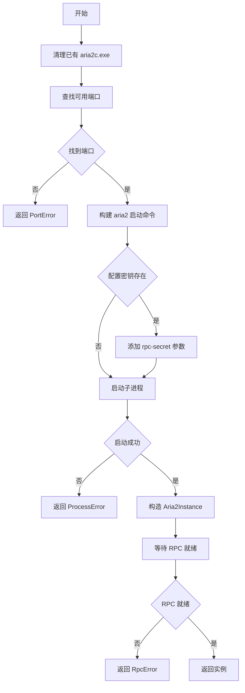
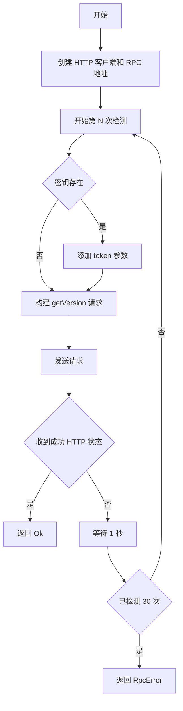

# process.rs

## 公有函数

### check_port_available
- 函数定义：`pub fn check_port_available(port: u16) -> bool`
- 入参：`port: u16`；待检测的本地 TCP 端口。
- 返回值：`bool`；能够绑定 `127.0.0.1:port` 时为 `true`。
- 错误信息：不返回错误；绑定失败转换为 `false`。
- 设计流程图：

### find_available_port
- 函数定义：`pub fn find_available_port() -> Aria2Result<u16>`
- 入参：无。
- 返回值：`Aria2Result<u16>`；返回端口范围内第一个可用端口。
- 错误信息：没有可用端口时返回 `Aria2Error::PortError`。
- 设计流程图：

### kill_existing_aria2
- 函数定义：`pub fn kill_existing_aria2()`
- 入参：无。
- 返回值：无（`()`）；尝试结束所有 `aria2c.exe` 进程。
- 错误信息：不返回错误；`taskkill` 执行失败被忽略。
- 设计流程图：

### start_aria2_rpc
- 函数定义：`pub async fn start_aria2_rpc(config: &Aria2Config) -> Aria2Result<Aria2Instance>`
- 入参：`config: &Aria2Config`；aria2 可执行文件、下载目录、连接数、分片大小及可选密钥的配置。
- 返回值：`Aria2Result<Aria2Instance>`；成功时返回子进程、实际端口和配置副本。
- 错误信息：端口不可用时返回 `PortError`；启动进程失败时返回 `ProcessError`；RPC 未就绪时返回 `RpcError`；清理旧进程失败被忽略。
- 设计流程图：

## 私有函数

### wait_for_rpc_ready
- 函数定义：`async fn wait_for_rpc_ready(port: u16, secret: &Option<String>) -> Aria2Result<()>`
- 入参：`port` 为 RPC 端口；`secret` 为可选认证密钥。
- 返回值：`Aria2Result<()>`；在最多 30 次检测内获得成功响应时返回 `Ok(())`。
- 错误信息：所有检测未成功时返回 `Aria2Error::RpcError("RPC 服务启动超时")`；单次请求失败或非成功状态被忽略。
- 设计流程图：

