# rpc.rs

## 公有函数

### new
- 函数定义：`pub fn new(port: u16, secret: Option<String>) -> Self`
- 入参：`port` 为 RPC 端口；`secret` 为可选 RPC 密钥。
- 返回值：`Self`；包含 HTTP 客户端、服务地址、密钥和请求编号的客户端。
- 错误信息：无；不执行网络请求。
- 设计流程图：
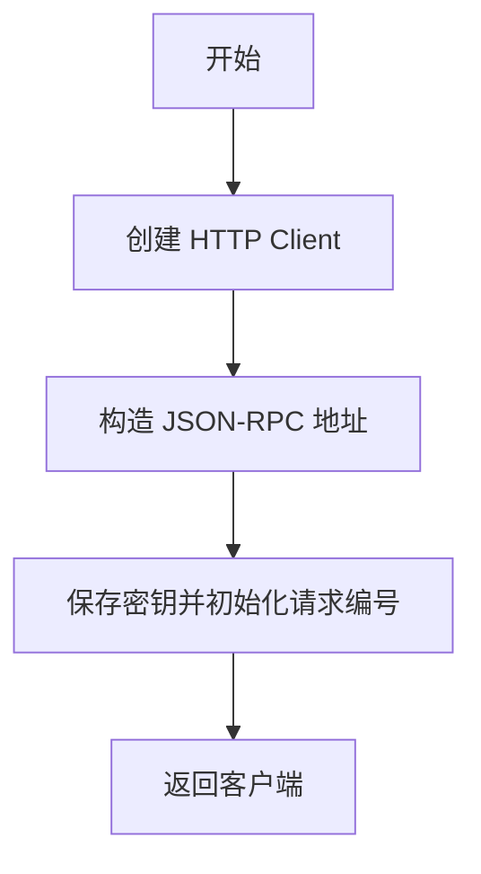

### add_uri
- 函数定义：
  ```rust
  pub async fn add_uri(
      &self,
      uris: Vec<String>,
      options: Option<DownloadOptions>,
  ) -> Aria2Result<String>
  ```
- 入参：`&self` 为 RPC 客户端；`uris` 为待下载 URI；`options` 为可选下载配置。
- 返回值：`Aria2Result<String>`；返回已有任务或新建任务的 GID。
- 错误信息：重复任务检测或 RPC 调用失败时返回 `RpcError`。
- 设计流程图：
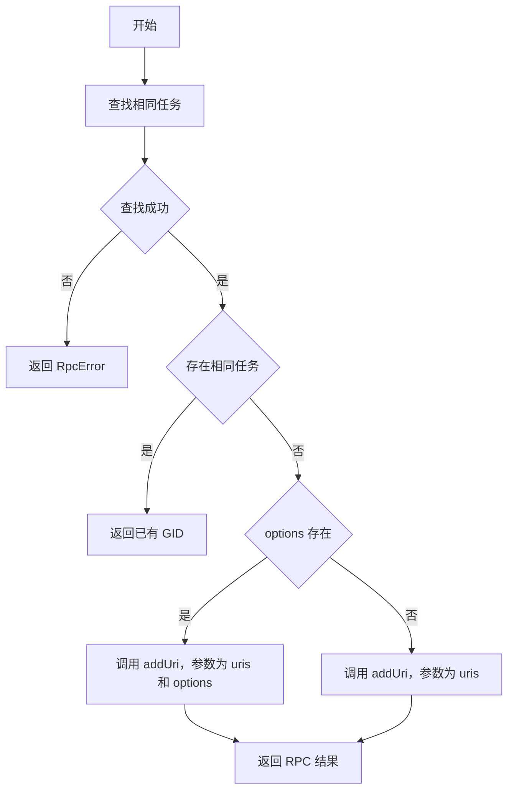

### tell_status
- 函数定义：`pub async fn tell_status(&self, gid: &str) -> Aria2Result<DownloadStatus>`
- 入参：`&self` 为 RPC 客户端；`gid` 为任务标识。
- 返回值：`Aria2Result<DownloadStatus>`；指定任务状态。
- 错误信息：序列化、请求、响应解析或服务端错误时返回 `RpcError`。
- 设计流程图：
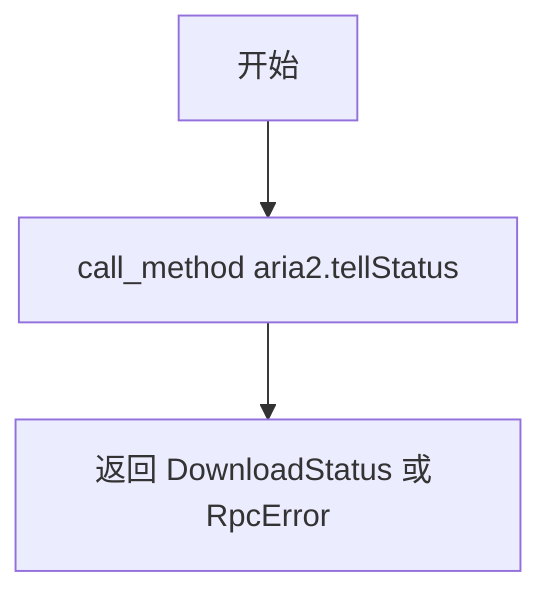

### tell_active
- 函数定义：`pub async fn tell_active(&self) -> Aria2Result<Vec<DownloadStatus>>`
- 入参：`&self`；RPC 客户端。
- 返回值：`Aria2Result<Vec<DownloadStatus>>`；活跃任务列表。
- 错误信息：序列化、请求、响应解析或服务端错误时返回 `RpcError`。
- 设计流程图：
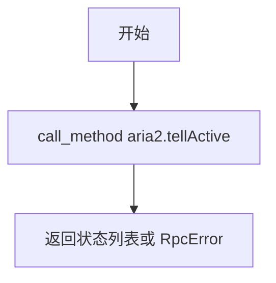

### tell_waiting
- 函数定义：`pub async fn tell_waiting(&self, offset: u32, num: u32) -> Aria2Result<Vec<DownloadStatus>>`
- 入参：`&self` 为 RPC 客户端；`offset` 为起始偏移；`num` 为返回数量。
- 返回值：`Aria2Result<Vec<DownloadStatus>>`；等待任务列表。
- 错误信息：序列化、请求、响应解析或服务端错误时返回 `RpcError`。
- 设计流程图：
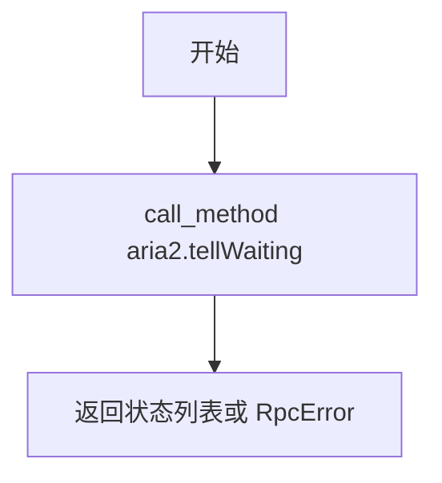

### tell_stopped
- 函数定义：`pub async fn tell_stopped(&self, offset: u32, num: u32) -> Aria2Result<Vec<DownloadStatus>>`
- 入参：`&self` 为 RPC 客户端；`offset` 为起始偏移；`num` 为返回数量。
- 返回值：`Aria2Result<Vec<DownloadStatus>>`；已停止任务列表。
- 错误信息：序列化、请求、响应解析或服务端错误时返回 `RpcError`。
- 设计流程图：
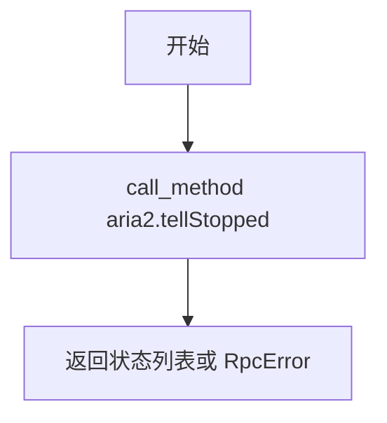

### get_files
- 函数定义：`pub async fn get_files(&self, gid: &str) -> Aria2Result<Vec<FileInfo>>`
- 入参：`&self` 为 RPC 客户端；`gid` 为任务标识。
- 返回值：`Aria2Result<Vec<FileInfo>>`；任务关联的文件信息。
- 错误信息：序列化、请求、响应解析或服务端错误时返回 `RpcError`。
- 设计流程图：
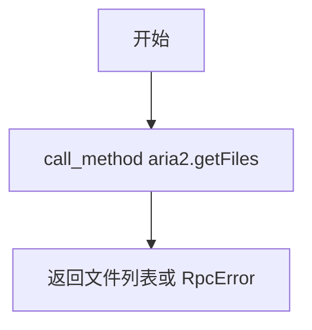

### get_global_stat
- 函数定义：`pub async fn get_global_stat(&self) -> Aria2Result<GlobalStat>`
- 入参：`&self`；RPC 客户端。
- 返回值：`Aria2Result<GlobalStat>`；全局下载统计。
- 错误信息：序列化、请求、响应解析或服务端错误时返回 `RpcError`。
- 设计流程图：
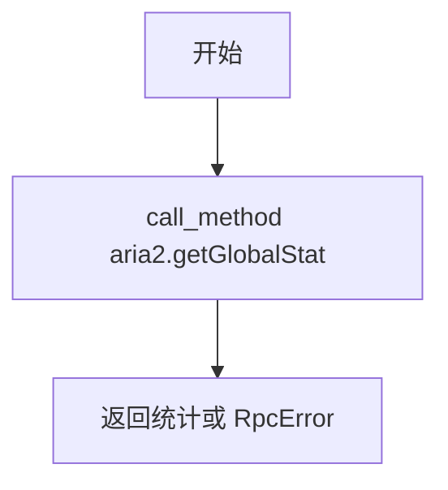

### pause
- 函数定义：`pub async fn pause(&self, gid: &str) -> Aria2Result<String>`
- 入参：`&self` 为 RPC 客户端；`gid` 为要暂停的任务标识。
- 返回值：`Aria2Result<String>`；aria2 返回的任务 GID。
- 错误信息：序列化、请求、响应解析或服务端错误时返回 `RpcError`。
- 设计流程图：
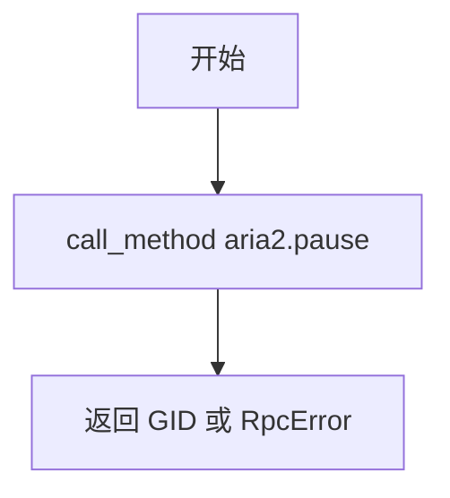

### unpause
- 函数定义：`pub async fn unpause(&self, gid: &str) -> Aria2Result<String>`
- 入参：`&self` 为 RPC 客户端；`gid` 为要恢复的任务标识。
- 返回值：`Aria2Result<String>`；aria2 返回的任务 GID。
- 错误信息：序列化、请求、响应解析或服务端错误时返回 `RpcError`。
- 设计流程图：
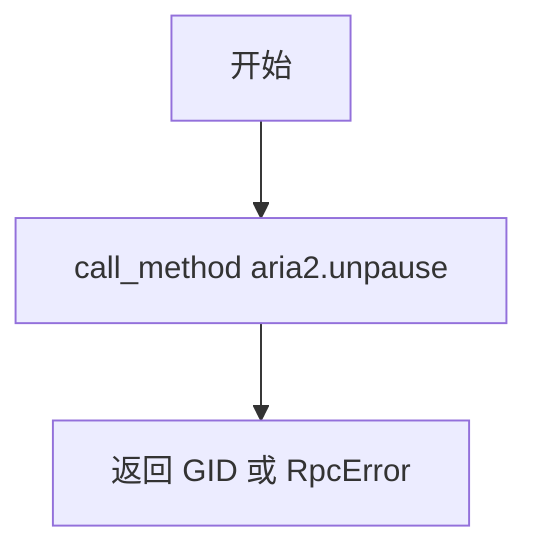

### remove
- 函数定义：`pub async fn remove(&self, gid: &str) -> Aria2Result<String>`
- 入参：`&self` 为 RPC 客户端；`gid` 为要移除的任务标识。
- 返回值：`Aria2Result<String>`；aria2 返回的任务 GID。
- 错误信息：序列化、请求、响应解析或服务端错误时返回 `RpcError`。
- 设计流程图：
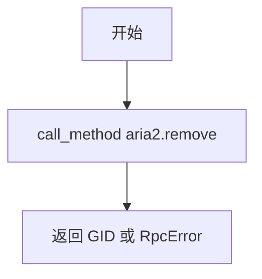

### shutdown
- 函数定义：`pub async fn shutdown(&self) -> Aria2Result<String>`
- 入参：`&self`；RPC 客户端。
- 返回值：`Aria2Result<String>`；aria2 返回的关闭结果。
- 错误信息：序列化、请求、响应解析或服务端错误时返回 `RpcError`。
- 设计流程图：
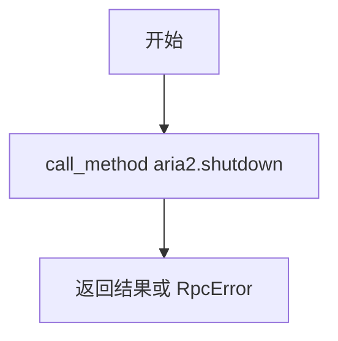

## 私有函数

### call_method
- 函数定义：
  ```rust
  async fn call_method<T, R>(&self, method: &str, params: T) -> Aria2Result<R>
  where
      T: Serialize,
      R: for<'de> Deserialize<'de>,
  ```
- 入参：`&self` 为 RPC 客户端；`method` 为 RPC 方法名；`params` 为可序列化参数。
- 返回值：`Aria2Result<R>`；将响应的 `result` 字段反序列化为 `R`。
- 错误信息：参数序列化、HTTP 请求、响应 JSON 解析、服务端返回 `error` 或结果反序列化失败时返回 `RpcError`。
- 设计流程图：
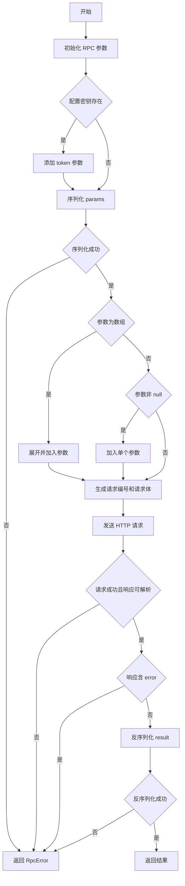

### find_existing_task
- 函数定义：
  ```rust
  async fn find_existing_task(
      &self,
      uris: &[String],
      options: &Option<DownloadOptions>,
  ) -> Aria2Result<Option<String>>
  ```
- 入参：`&self` 为 RPC 客户端；`uris` 为目标 URI；`options` 为可选下载配置。
- 返回值：`Aria2Result<Option<String>>`；匹配时返回 GID，不匹配时为 `None`。
- 错误信息：三个任务列表查询和单个状态查询失败被忽略；`is_same_task` 的错误会被传播。
- 设计流程图：
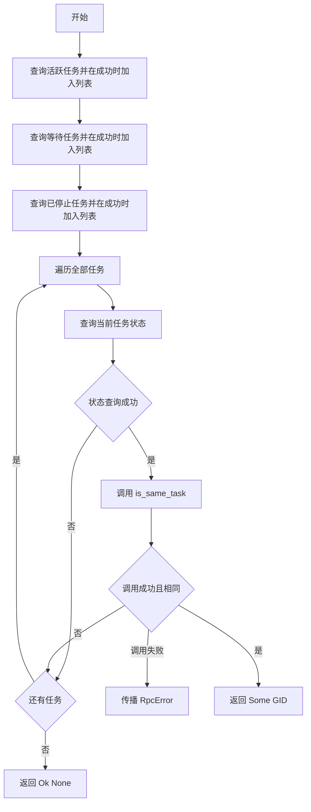

### is_same_task
- 函数定义：
  ```rust
  async fn is_same_task(
      &self,
      status: &DownloadStatus,
      uris: &[String],
      options: &Option<DownloadOptions>,
  ) -> Aria2Result<bool>
  ```
- 入参：`&self` 为 RPC 客户端；`status` 提供待查任务 GID；`uris` 为目标 URI；`options` 提供可选目标目录。
- 返回值：`Aria2Result<bool>`；URI 和目录条件匹配时为 `true`，否则为 `false`。
- 错误信息：`get_files` 失败被忽略并返回 `Ok(false)`；当前实现不主动构造错误。
- 设计流程图：
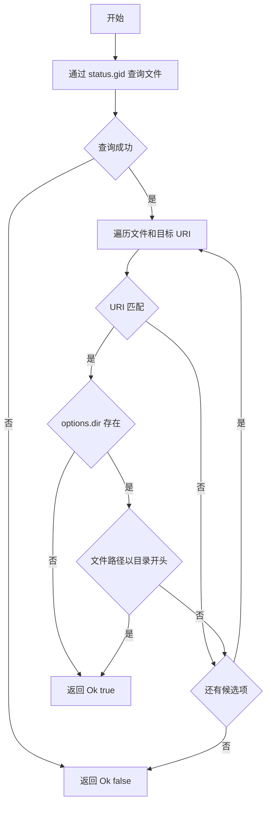
