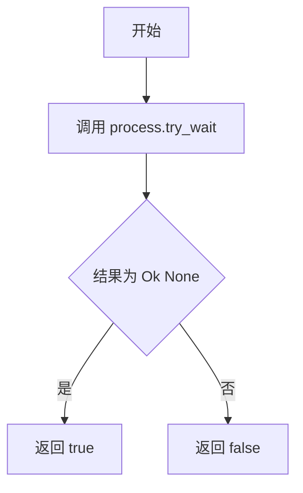
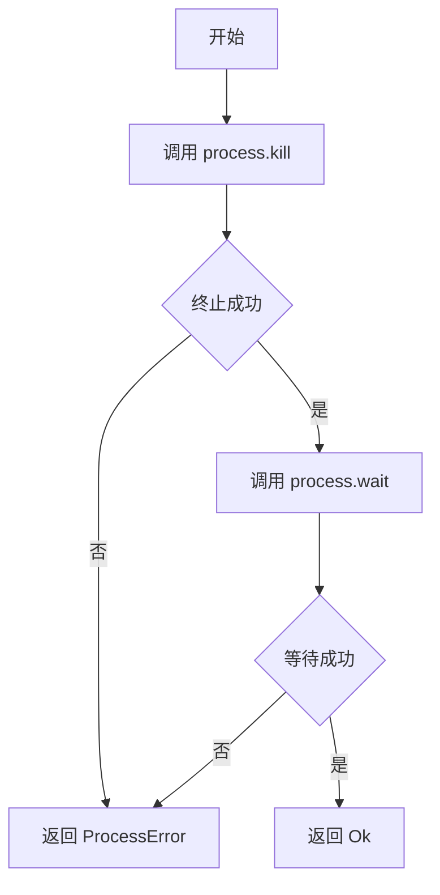
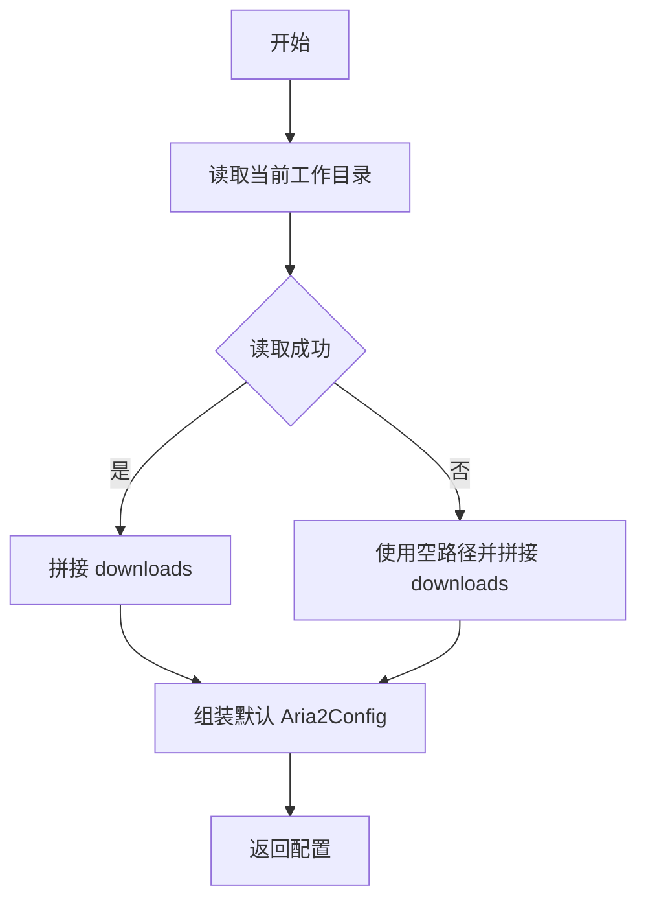

# types.rs

## 公有函数

### is_running
- 函数定义：`pub fn is_running(&mut self) -> bool`
- 入参：`&mut self`；包含 aria2 子进程的运行实例。
- 返回值：`bool`；子进程未退出时为 `true`，已退出或查询失败时为 `false`。
- 错误信息：不返回错误；`try_wait` 失败转换为 `false`。
- 设计流程图：

### kill
- 函数定义：`pub fn kill(&mut self) -> Aria2Result<()>`
- 入参：`&mut self`；包含 aria2 子进程的运行实例。
- 返回值：`Aria2Result<()>`；成功时子进程已被终止并完成等待。
- 错误信息：`kill` 或 `wait` 失败时返回 `Aria2Error::ProcessError`。
- 设计流程图：

## 私有函数

### default
- 函数定义：`fn default() -> Self`
- 入参：无。
- 返回值：`Self`；包含默认端口、下载目录、连接配置和 aria2 路径的 `Aria2Config`。
- 错误信息：不返回错误；当前目录读取失败时以空路径拼接 `downloads`。
- 设计流程图：

