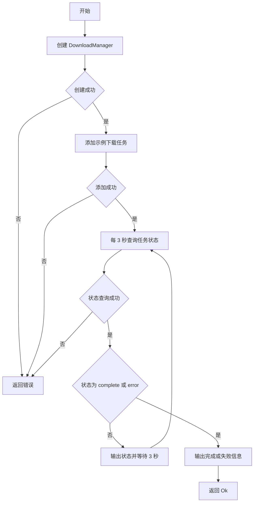

# main.rs 函数文档

## 公有函数

无。

## 私有函数

### main

- 函数定义：
  ```rust
  async fn main() -> Result<(), Box<dyn std::error::Error>>
  ```
- 入参：无。
- 返回值：`Result<(), Box<dyn std::error::Error>>`；成功时完成管理器初始化、示例任务创建及状态轮询。
- 错误信息：管理器创建、添加下载或状态查询失败时，通过 `?` 转换并返回 `Box<dyn std::error::Error>`。
- 设计流程图：

