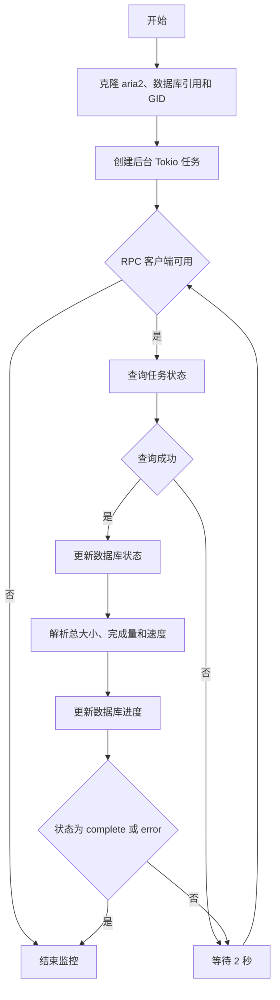
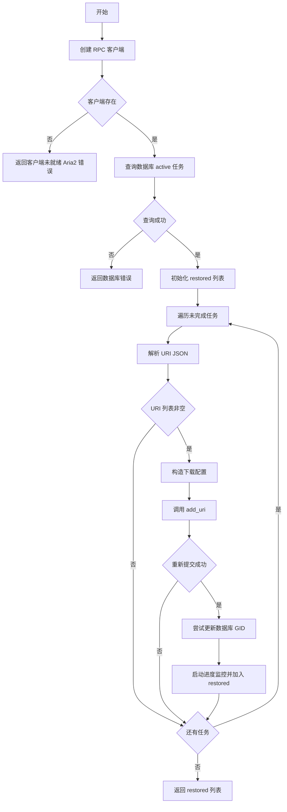

# monitor.rs 函数文档

## 公有函数

无。

## 私有函数

### start_progress_monitor

- 函数定义：
  ```rust
  async fn start_progress_monitor(&self, gid: &str)
  ```
- 入参：`gid: &str`，要监控的下载任务 GID；`&self` 提供 aria2 管理器和数据库引用。
- 返回值：无（`()`）。创建后台 Tokio 任务，定期同步任务状态和进度。
- 错误信息：不返回错误；RPC 客户端不可用时结束监控，状态查询失败时继续循环，数据库更新失败被忽略，数值解析失败使用 `0`。
- 设计流程图：


### restore_incomplete_downloads

- 函数定义：
  ```rust
  async fn restore_incomplete_downloads(&self) -> Result<Vec<String>>
  ```
- 入参：`&self`，下载管理器。
- 返回值：`Result<Vec<String>>`；返回成功重新提交并开始监控的任务 GID 列表。
- 错误信息：RPC 客户端不存在或数据库查询失败时返回错误；URI JSON 解析失败使用空列表；单个任务重新提交或 GID 更新失败被忽略并继续处理。
- 设计流程图：

