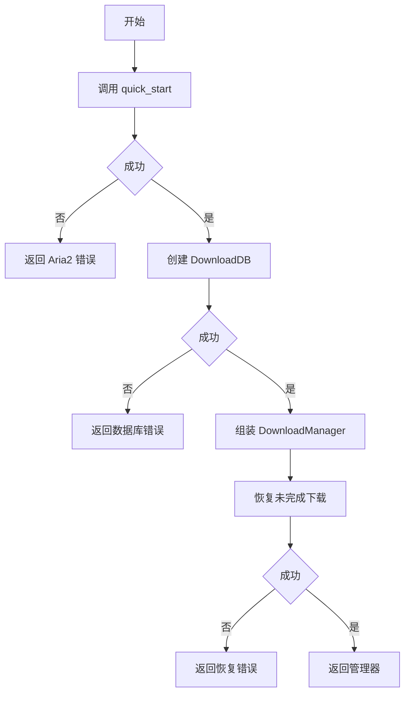
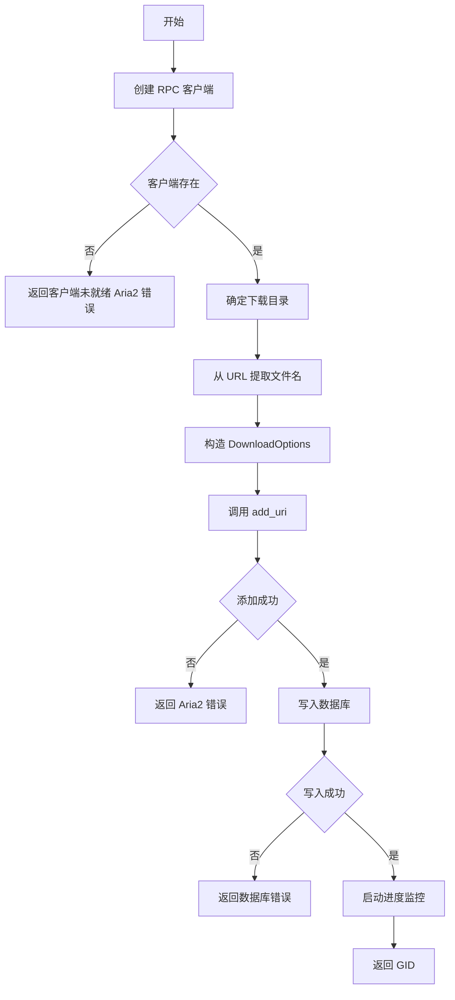
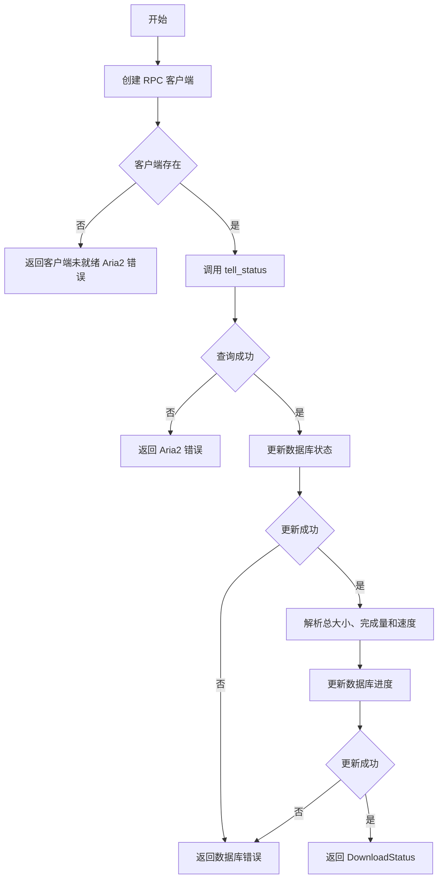
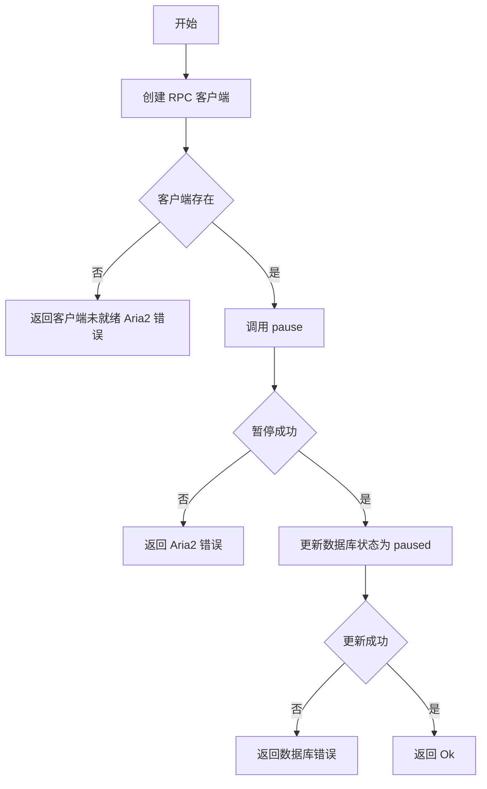
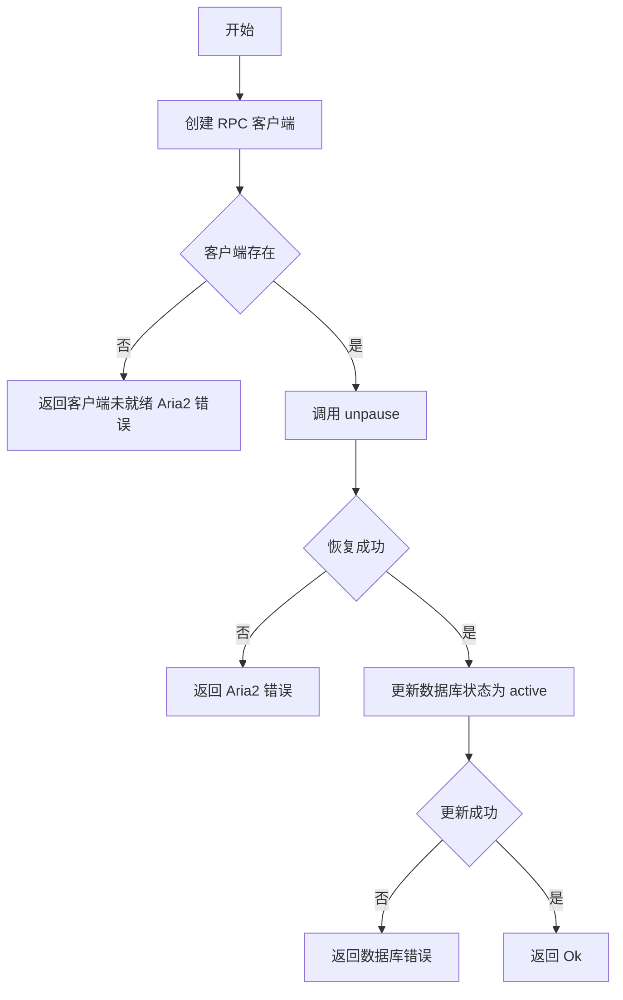
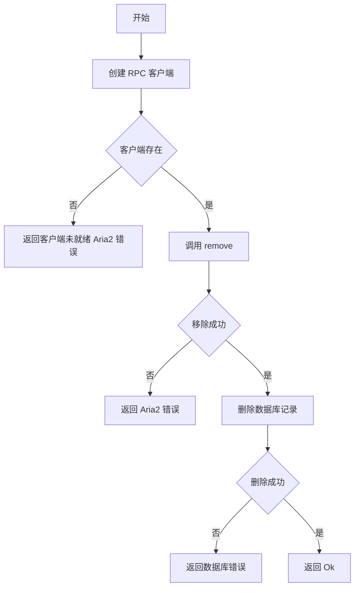

# operations.rs 函数文档

## 公有函数

### new

- 函数定义：
  ```rust
  pub async fn new() -> Result<Self>
  ```
- 入参：无。
- 返回值：`Result<Self>`；返回已启动 aria2、已连接数据库并完成未完成任务恢复的 `DownloadManager`。
- 错误信息：aria2 启动、数据库初始化或未完成任务恢复失败时返回对应 `DownloadError`。
- 设计流程图：


### add_download

- 函数定义：
  ```rust
  pub async fn add_download(&self, url: &str, download_dir: Option<&str>) -> Result<String>
  ```
- 入参：`url` 为下载地址；`download_dir` 为可选下载目录，为空时使用 `./downloads`。
- 返回值：`Result<String>`；返回 aria2 任务 GID。
- 错误信息：RPC 客户端不存在、aria2 添加任务失败或数据库写入失败时返回错误；文件名解析失败不会返回错误。
- 设计流程图：


### get_status

- 函数定义：
  ```rust
  pub async fn get_status(&self, gid: &str) -> Result<burncloud_download_aria2::DownloadStatus>
  ```
- 入参：`gid: &str`，要查询的下载任务 GID。
- 返回值：`Result<burncloud_download_aria2::DownloadStatus>`；返回 aria2 任务状态，并同步数据库状态和进度。
- 错误信息：RPC 客户端不存在、aria2 状态查询失败或数据库更新失败时返回错误；数值解析失败时使用 `0`。
- 设计流程图：


### pause

- 函数定义：
  ```rust
  pub async fn pause(&self, gid: &str) -> Result<()>
  ```
- 入参：`gid: &str`，要暂停的下载任务 GID。
- 返回值：`Result<()>`；成功时 aria2 任务已暂停且数据库状态为 `paused`。
- 错误信息：RPC 客户端不存在、aria2 暂停失败或数据库更新失败时返回错误。
- 设计流程图：


### resume

- 函数定义：
  ```rust
  pub async fn resume(&self, gid: &str) -> Result<()>
  ```
- 入参：`gid: &str`，要恢复的下载任务 GID。
- 返回值：`Result<()>`；成功时 aria2 任务已恢复且数据库状态为 `active`。
- 错误信息：RPC 客户端不存在、aria2 恢复失败或数据库更新失败时返回错误。
- 设计流程图：


### remove

- 函数定义：
  ```rust
  pub async fn remove(&self, gid: &str) -> Result<()>
  ```
- 入参：`gid: &str`，要移除的下载任务 GID。
- 返回值：`Result<()>`；成功时 aria2 任务已移除且数据库记录已删除。
- 错误信息：RPC 客户端不存在、aria2 移除任务失败或数据库删除失败时返回错误。
- 设计流程图：


## 私有函数

无。
